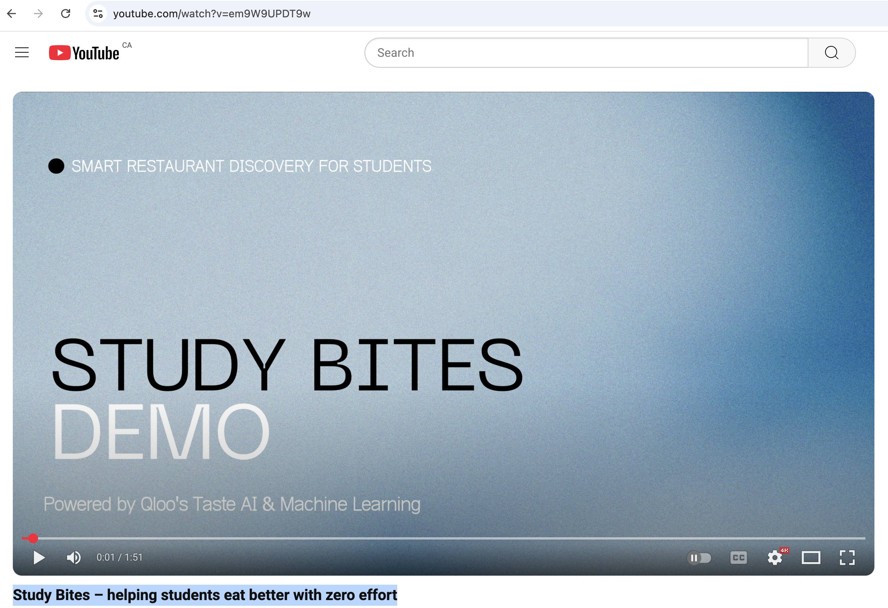
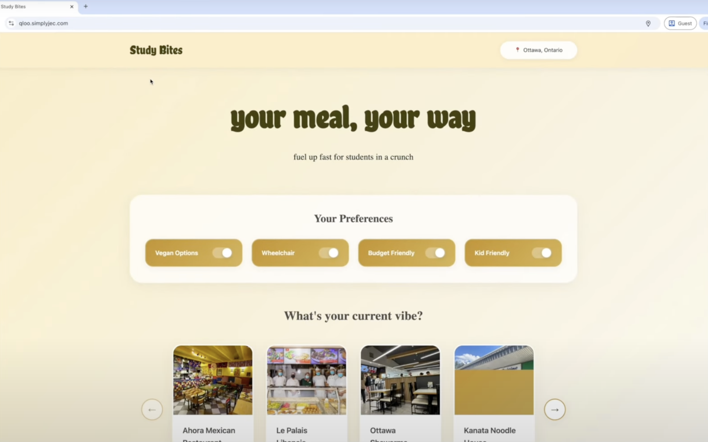
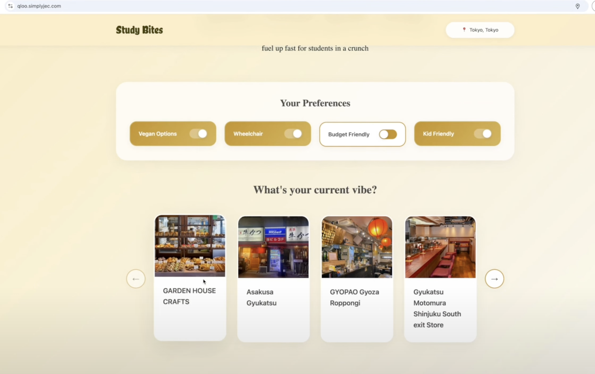
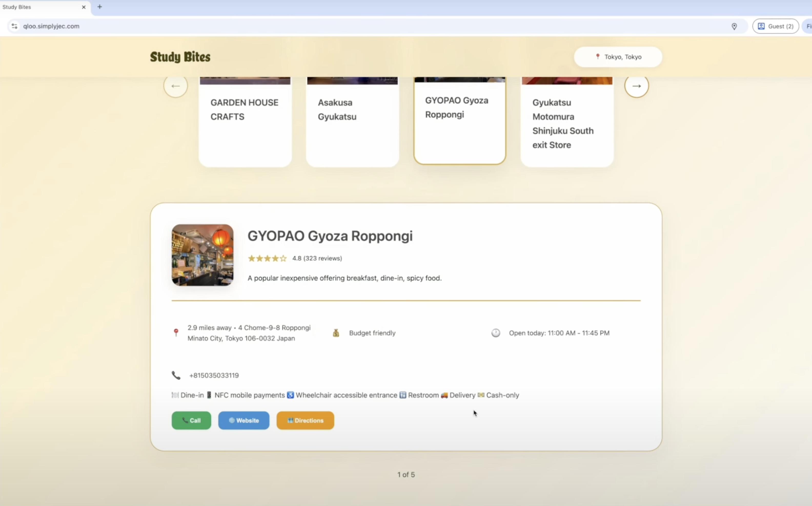
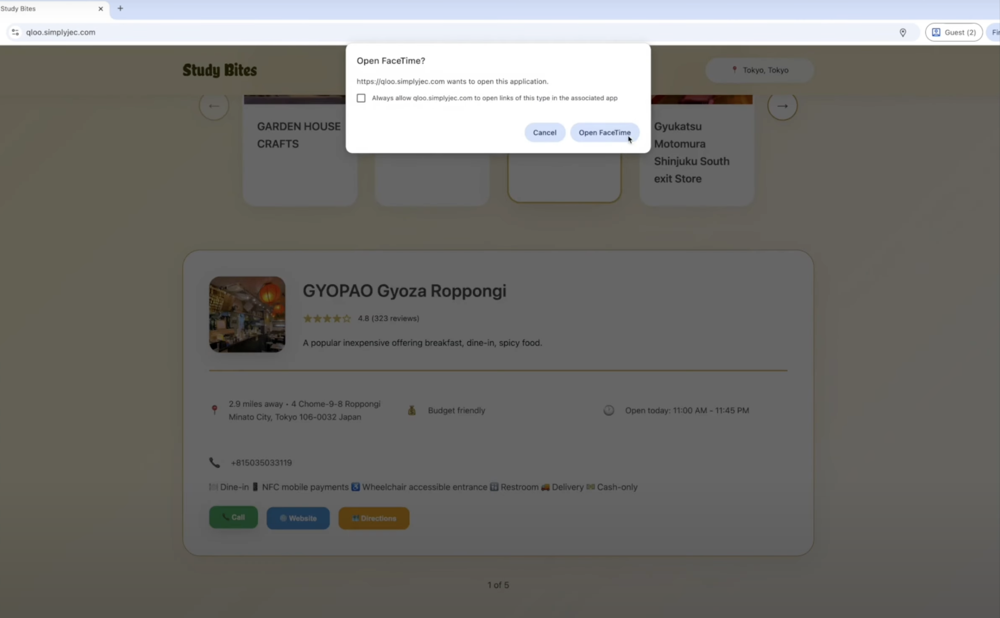
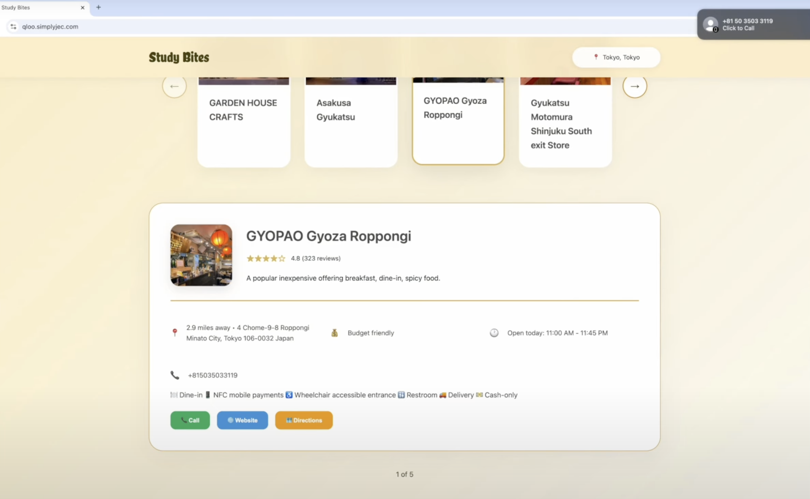

# study_bites
Application that provides curated healthy and accessible options based on students' location powered by Qloo Taste AI™ API and Hugging Face Image LLM.

For more information on its technology and implementation, refer to [Build Book](buildbook.md).

The presentation is [Study Bites – helping students eat better with zero effort](https://www.youtube.com/watch?v=em9W9UPDT9w).

Some screenshots of the application are:

